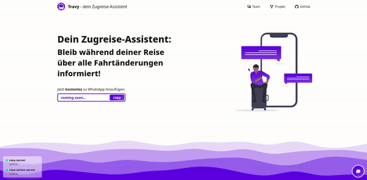

 

  

# 🚆 Travy - Train Travel Companion 🤖

###### ⚠️ Disclaimer: This was our final project for the 1. semester of "Computer Science & Design" at Hochschule München. This project is no longer being maintained nor deployed. For running it locally, read the according [Wiki page](https://github.com/ID-Start-Winter22/chat-team-11/wiki/%F0%9F%91%A8%E2%80%8D%F0%9F%92%BB-Install,-run-and-deploy). You will be able to run this project as long as the [bahn.expert](https://bahn.expert/) API is still alive.

# 📑 About:
## Description:
The Train Travel Companion is a chatbot which provides you with information to about your train, gives you live updates on your train journey  and answers questions.

## How does it work?
The chatbot is built using the [Rasa](https://rasa.com/) framework. 
To get live data about the trains, the backend makes requests to the public [bahn.expert](https://docs.bahn.expert/) API.

## Who is it for?
Train Travel Compagnion is for everyone who wants to revieve relevant and concise information about his train rides. We mainly target younger people, who want to avoid long research.

---

# 👨‍👨‍👧 Team:
| name | email |
| :------------- |:------------- |
| Lynn Starke | lstarke@hm.edu | 
| Markus Schnugg | schnugg@hm.edu |
| Theodor Peifer | theodor.peifer@hm.edu |

---

# 👉 Demo:

  

